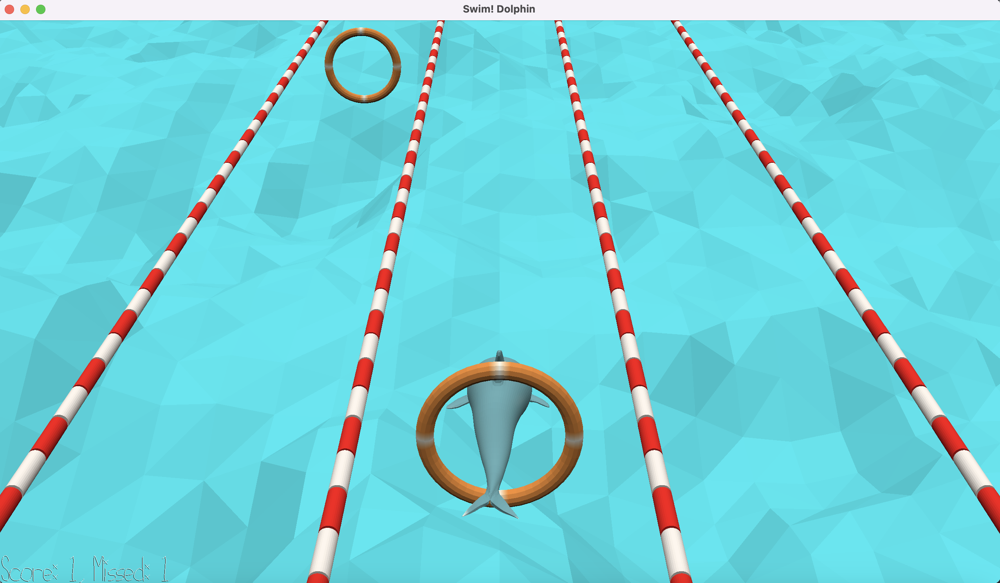

# Swim! Dolphin

Author: Qiru Hu

Design: As a dolphin, you like swimming and you want to jump through as much buoys as possible. The buoys will float towards you in three swimming lanes. You must swim in the correct lanes with buoys.

Screen Shot:

How To Play:
- Press A to go to the left
- Press D to go to the right
- Press W to jump

The player can control the dolphin to go to either of the 3 swimming lanes and jump to the air. 
Each time the dolphin jumps through a buoy, the score will increase by 1. Each time the dolphin misses a buoy, the missed count will increase by 1. The game finishes when the missed count reaches 5.
The buoys will be generated randomly in the swimming lanes and in two random heights. Dolphin need to jump to reach higher buoys. The buoys will be generated and moving at increasing speed.

This game was built with [NEST](NEST.md).
